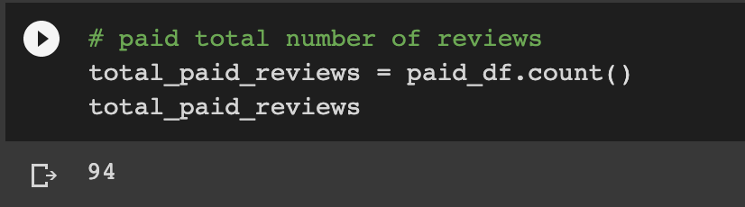
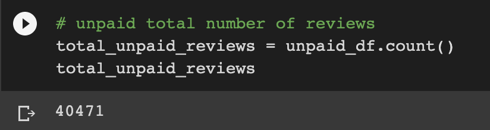
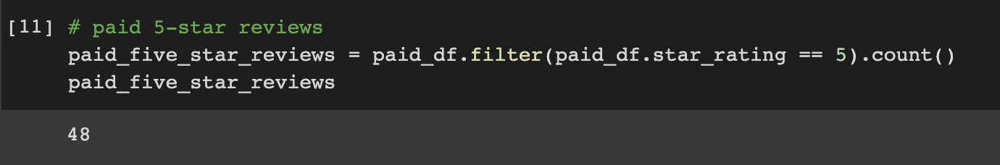
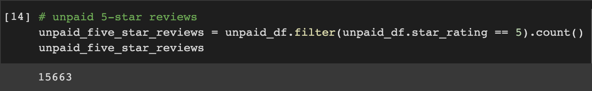
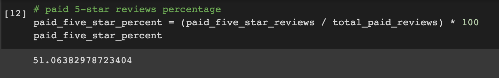
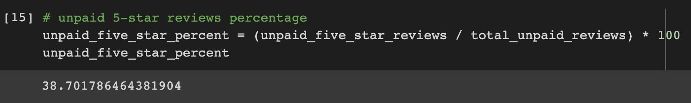

# Amazon_Vine_Analysis

## Project Overview

The purpose of this project is to analyze the Amazon Vine program and determine if there is a bias toward favorable reviews from Vine members.
Using PySpark to perform the ETL process and extract the dataset of reviews on video games, we transformed the data, connected to an AWS RDS instance, loaded the transformed data into pgAdmin and calculated different metrics.

## Results

### Total Number of Reviews 

- Number of Vine reviews:

- Number of non-Vine reviews:

### Total Five-Star Reviews

- Number of Five-Star Vine reviews:

- Number of non-Vine Five-Star reviews:

### Percentage of Five-Star Reviews

- Five-Star Vine review percent:

- Non-Vine Five-Star review percent:

## Summary 

We seem to see a positivity bias for reviews amongst the Vine program after calculating that 50.1% of reviews from the Vine program were five-star reviews, whereas non-Vine members left five-star reviews only 38.7% of the time. To provide further analysis on these reviews, we could calculate the mean (as well as the median and mode) of the reviews across Vine and non-Vine members to see if there is any further insights to be gained from the pool of reviews and support this data even more. 
